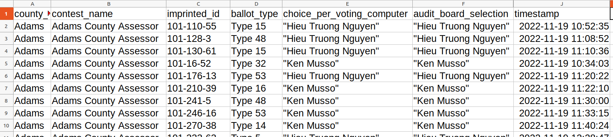

class: center, middle

### Title

Election Verification Network conference

Panel: Neal McBurnett

2023-03-16

[Remarkjs documentation](https://remark.js.org/)

???
Slide notes here

See also README.md

Quickstart:

fn=corla-evn2023

To display, run `view-presentation`
To make pdf, run: decktape http://localhost:8000/#1  $fn.pdf
To publish, run: rsync -av --exclude '.git' ../$fn bcn:public_html/elections

First, change the title and <meta property... in the index.html

Use '?' hotkey for documentation

Modify the slides.md and reload browser page

---
## Neal McBurnett
* Consultant
* Software developer
* Working on election audits and integrity since 2003
* Poll worker
* Pioneered RLAs in Colorado with my own code in 2010, Boulder County
* On teams that wrote the software for Colorado's current state-wide audit
* Volunteer Voting Board member
* LWV Colorado Election Security position, 2022
* Speaking for myself

---
## Introduction
* Bullets...

---
## Image scaling
Untouched image overflows to the right

---
## Show scaled image via HTML img tag width="750"

Perhaps works up to width=800?

Also works:

`convert orig.png -resize 50% smaller.png`

???

---
## TODO
Tried Scaled to 50 px, from some github issue comment, but this (with leading "!") doesn't work - just get a blank screen...

[:scale 50px](image.png)

Perhaps I need to install a plugin or something?

How to change font size?

How to add a QR code to link to the online version?
